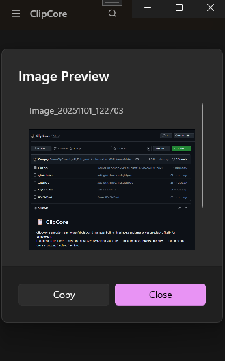

# 📋 ClipCore

**ClipCore** is a modern and powerful clipboard manager built with **WinUI 3** and **.NET 8**, designed specifically for **Windows 11**.  
It automatically tracks, stores, and organizes everything you copy — including **text, images, and files** — and presents them in a clean, intuitive interface.

---

## 🧠 Overview

ClipCore helps you manage your clipboard history more efficiently.  
Whether you copy text snippets, images, or entire files, ClipCore keeps everything accessible and categorized.  

You can search, filter, and restore previous clipboard items in just a few clicks.  
Perfect for developers, designers, and power users who copy and paste all day long.

---

## ✨ Features

- 🪟 **Modern WinUI 3 Interface** — Fluent Design, native Windows 11 look & feel.  
- ⚡ **Real-Time Clipboard Tracking** — Automatically detects copied text, images, and files.  
- 🗂️ **Smart Categorization** — Groups clipboard items by type and source.  
- 🔍 **Search & Filter** — Quickly find anything from your clipboard history.  
- 💾 **Persistent Storage** — Keeps clipboard history saved even after reboot.  
- 🧰 **Local Database Support** — Uses SQLite for lightweight and fast storage.  
- 🧭 **Compact Mode** — A minimal floating view for fast access.  
- 🌙 **Dark / Light Mode** — Fully supports system theme preferences.  
- 🔐 **Privacy Options** — Option to exclude sensitive apps from being monitored.  

---

## 🛠️ Technologies Used

| Category | Technology |
|-----------|-------------|
| Framework | .NET 8 |
| UI Library | WinUI 3 |
| Language | C# |
| Database | SQLite |
| Architecture | MVVM Pattern |
| Platform | Windows 11 |
| IDE | Visual Studio Insiders |

---

## 🚀 Installation

1. Clone the repository:
   ```bash 
   git clone https://github.com/Kleaopsy/ClipCore.git
   cd ClipCore

---

## 📸 Screenshots

Below are some screenshots of **ClipCore** in action on Windows 11.  
Each section demonstrates a key part of the interface and its functionality.

| Home Page | Settings Page |
|------------|----------------|
|  |  |

| Image Preview | Text Preview |
|----------------|---------------|
|  |  |

> 💡 *The interface is fully responsive to Windows 11’s light and dark themes, using native WinUI 3 components for a seamless experience.*

---

## 🧠 Interface Highlights

- **Home Page:** Displays clipboard history with item type icons and quick access buttons.  
- **Settings:** Customize clipboard behavior, auto-clean intervals, and privacy filters.  
- **Image Preview:** Instantly shows copied image thumbnails and allows saving or re-copying.  
- **Text Preview:** Displays copied text with formatting, quick copy, and favorite options.  

---

## 🪶 UI Design Philosophy

ClipCore’s interface was designed with minimalism and clarity in mind.  
Every element follows Windows 11’s Fluent Design guidelines — rounded corners, subtle shadows, and fluid animations.  
The goal was to create a **productivity tool that feels like a native part of the OS.**

---

*(All screenshots are taken from the development build on Windows 11.)*
